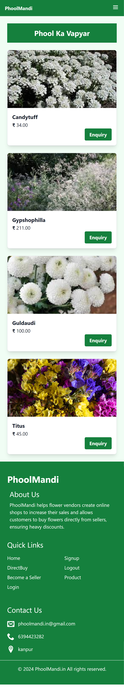

# PhoolMandi WebApp

[Live](http://www.phoolmandi.in/)

PhoolMandi is a real-world web application designed to enable flower vendors to create online shops and increase sales through direct customer purchases and discounts. The application is hosted on AWS EC2, providing a robust and scalable platform for users.

## Technologies Utilized

- **Spring Boot**
- **MongoDB**
- **React.js**
- **OAuth2**
- **JWT**
- **Gmail API**
- **Gmail OTP Verification**
- **AWS EC2**

## Features

### Online Shops for Flower Vendors
PhoolMandi allows flower vendors to easily set up their online shops, providing a platform to display their products and manage sales.

### Customer Purchases and Discounts
Customers can browse through various flower shops, make purchases, and avail discounts directly through the platform.

### Customer Inquiries
The app includes features for handling customer inquiries, ensuring vendors can respond to questions and provide support efficiently.

### Database Management
Managed and optimized databases using MongoDB to ensure data efficiency and reliability.

### Security and Authentication
Utilized OAuth2 and JWT for secure user authentication, along with Gmail API and Gmail OTP Verification for enhanced security.

### Login and Logout
Implemented a secure login and logout system using OAuth2 and JWT, ensuring safe access to user accounts.

.png)

## Deployment

PhoolMandi is deployed on AWS EC2, providing a scalable and reliable environment for the application.

